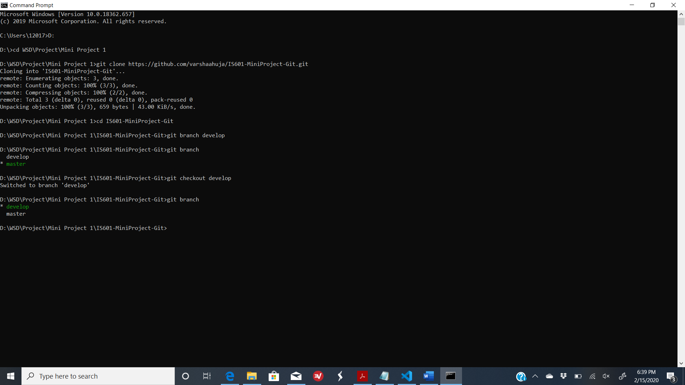
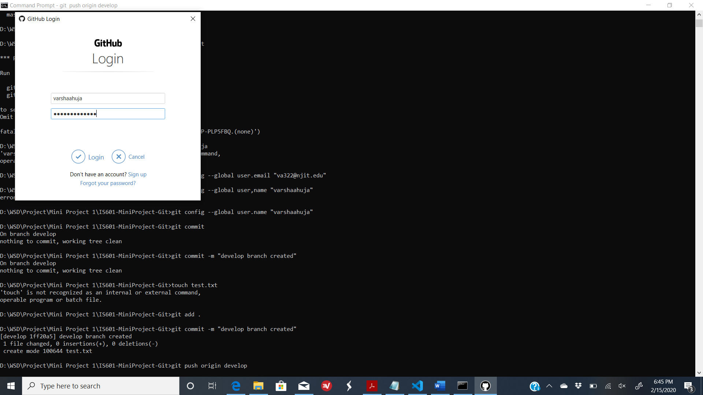
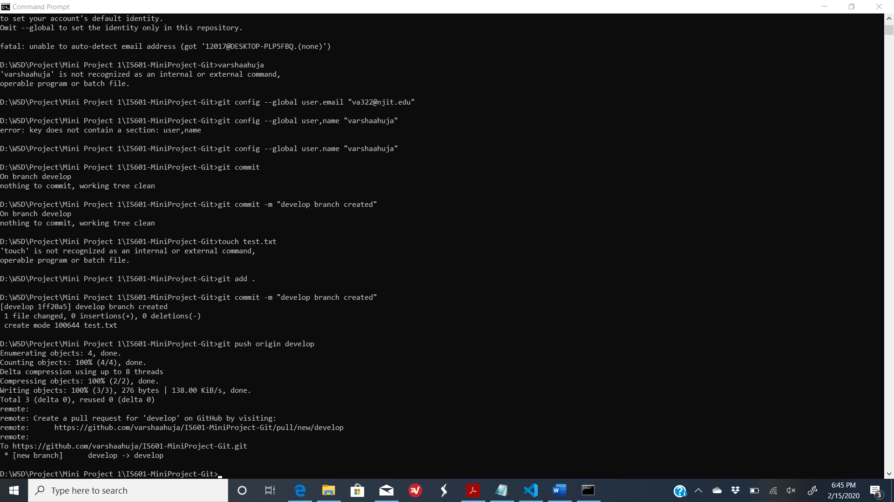

# &#x1F539; Branching in Git &#x1F539;

This section will talk about concept of branching, how to create branches & its uses.

## &#x1F539; Concept of Branching:

In a team working towards same project but on different features, the concept of branching comes in handy. Different branches are created for each feature of the project so that multiple members can work on the project simultaneously, efficiently without dependencies & have a product to deliver early.
By default, a master branch is created in any repository. Then a branch is created for each feature, which can be later deleted once the code is merged with t he master branch.

## &#x1F539; Creating Branches:

Below are the basic steps to create branches using command line:

1. Clone the repsoitory and navigate to the cloned repository using command line.

2. Create a branch using **git branch <branch name>** command.

3. To view the branch in Github account cloned repository, push the branch to git using **git push origin <branch name>** after performing the edit/add/commit process.

