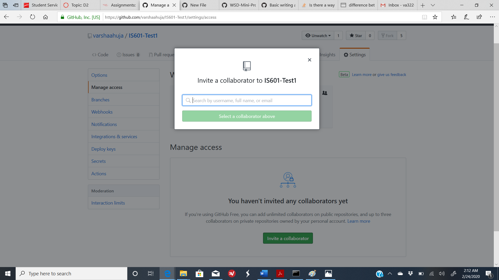
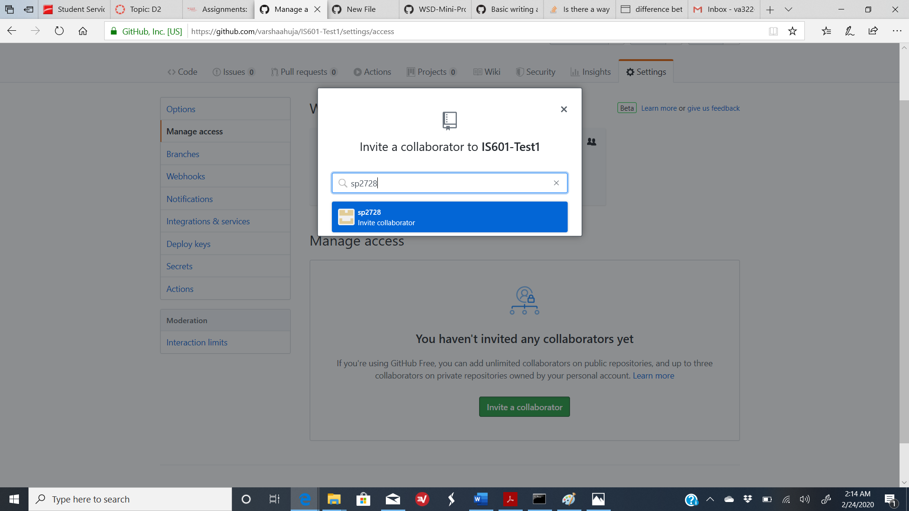

# &#x1F539; Collaborator in Github &#x1F539;

A collaborator is added to a repository incase there are multiple people working on the same project and require uninterrupted access to the changes to be made in the project in order to maybe keep up with timelines. Simple example can be when people are working in shifts and are also working on the same code then it would be easier for them to work seemlessly if they are collaborators. A public repository can have multiple collaborators but a private repository can have upto 3 collaborators.

Below are the steps to add collaborator to your repository:

1. Ask for the Github username of the person you're inviting as a collaborator.

2. On GitHub, navigate to the main page of the repository.

3. Under your repository name, click **Settings**. 

4. In the left sidebar, click **Manage access**. Now click on **Invite a collaborator** button.

5. Under "Collaborators", start typing the collaborator's username.

6. Select the collaborator's username from the drop-down menu. 

7. Click Add collaborator. 

8. The user will receive an email inviting them to the repository. Once they accept your invitation, they will have collaborator access to your repository. Till then the invitation would be visible as Pending.

9. Once they accept the invitation they can work collaboratively in the project without any delays caused due to merge requests.

