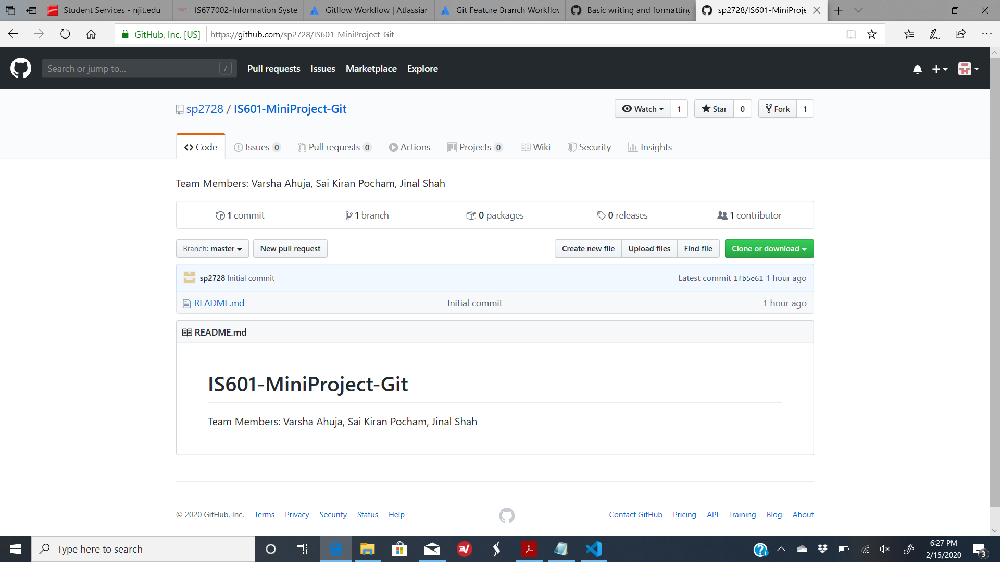
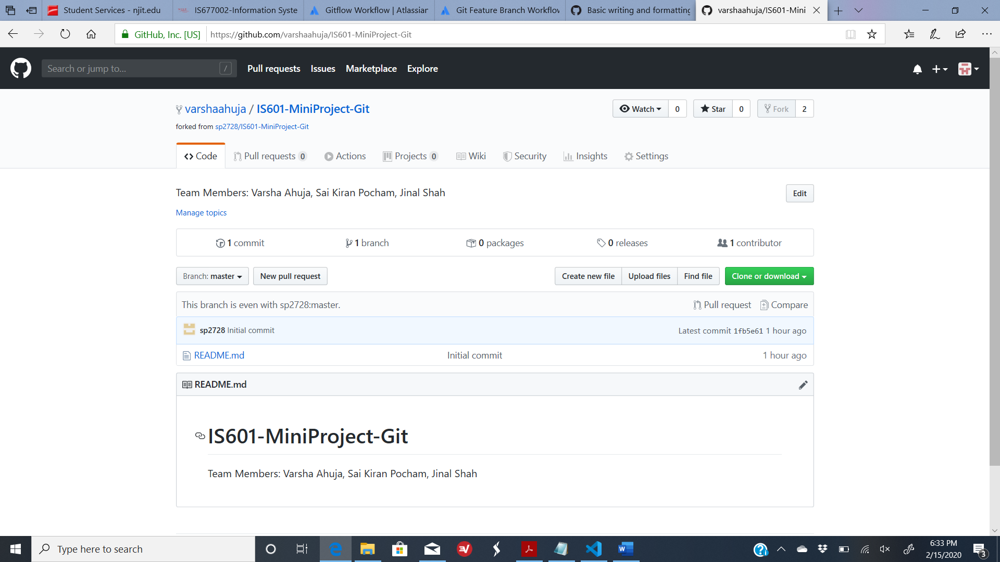
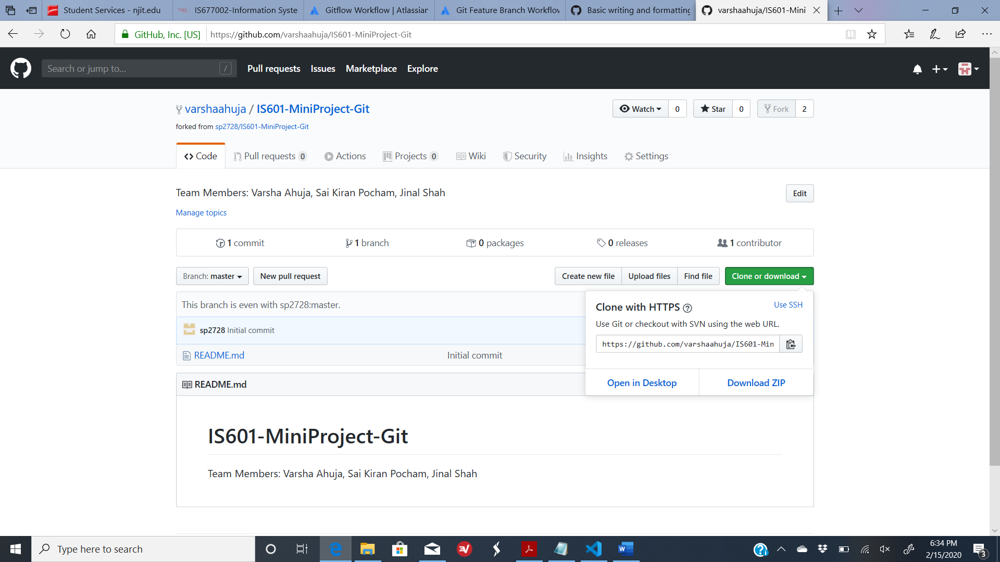
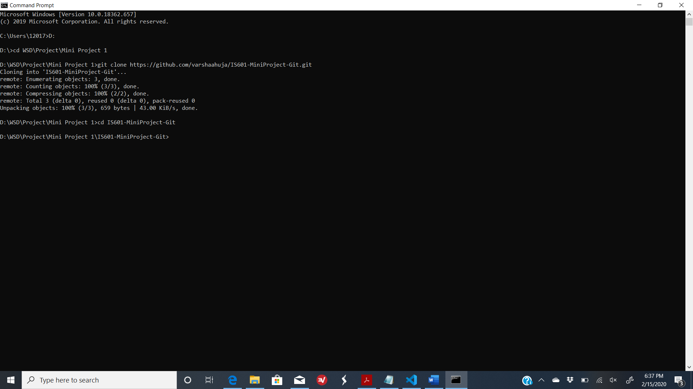

# &#x1F539; Forking Vs Cloning &#x1F539;

Below topics will be covered in this document:

 - [Forking](https://github.com/sp2728/WSD-Mini-Project-1/blob/master/forkVsClone.md#-forking)
 - [Cloning](https://github.com/sp2728/WSD-Mini-Project-1/blob/master/forkVsClone.md#-cloning)
 - [Forking Vs Cloning](https://github.com/sp2728/WSD-Mini-Project-1/blob/master/forkVsClone.md#-forking-vs-cloning)
 
Before getting into the comparision of forking & cloning let us first understand the basic meanings of the same.

## &#x1F539; Forking

Forking is a concept of copying a repository (Project) on your Github account. It can help you experiment with the code you have copied without affecting the original project code. You could edit the original code and create pull request (discussed in [pullRequest.md](https://github.com/varshaahuja/WSD-Mini-Project-1/blob/master/pullRequest.md) document) for the changes, which indicates the owner of the project to verify changes and then decide if to merge or not to merge it to the original code.
Below steps show how to fork a repository:

 1. Navigate to the repository which must be forked.
 
 
 
 2. Click on fork
 
 
 
 ## &#x1F539; Cloning
 
 Cloning is a process of creating a copy of a Git Repository to the local machine. This helps maintain a set of all the files from original repository in your local. Any kind of commits done to your local will not be moved to the original repository unless pushed to the same. Cloning can be performed through either SSH or HTTPS.
 Below steps show how to clone a repository using HTTPS:
 
 1. Navigate to the repository to be cloned through your github account.
 2. Click on clone or download and copy the link
 
 
 
 3. On command line run **git clone <*paste the copied link here*>** command
 
 
 
 ## &#x1F539; Forking Vs Cloning
 
 Below table brings out the basic differnces in Forking & Cloning:
 
| Sl No | Forking | Cloning |
| --------- | ------------- | ------------- |
| 1 | It is a concept  | It is a process  |
| 2 | It is done on Github Account  | It is done using Git  |
| 3 | Copied repository remains on Github account | Copied repository remains on local |
| 4 | Changes can be pushed in original repository using Pull request | Changes can be pushed directly to Master repository if you wokr as collaborator or else you have to fork the repository first to create pull request |
