# Git Commands
## 1. Repository 
A repository is a storage space where your project lives. It can be local to a folder on your computer, or it can be a storage space on GitHub or another online host.

You can create a new repository on your personal account or any organization as shown in the image below:

In the upper-right corner of GitHub page, use the  drop-down menu, and select **New repository**.

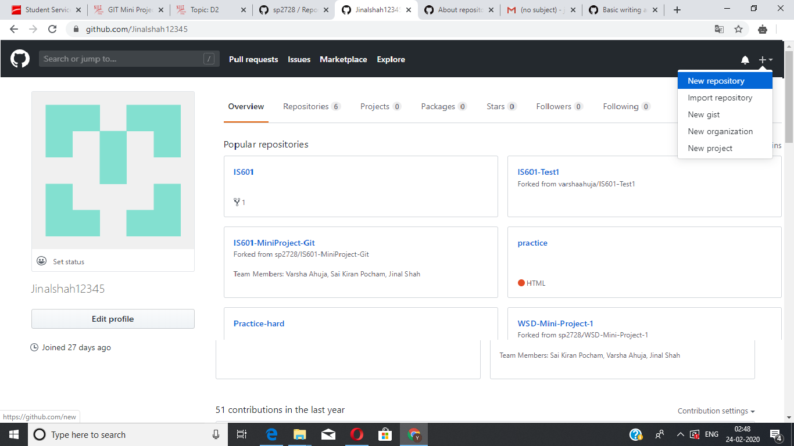

In this way, you can create repositories on GitHub. 

You can keep code files, text files, images or any kind of a file in a repository.

## 2. Clone
When you create a repository on GitHub, it exists as a remote repository. You can clone your repository to create a local copy on your computer and synchronize between the two locations.

Basically, Cloning a git repository means that you create a local copy of the code provided by developer. 

You can simply do it with a command line: git clone 

For Example, git clone https://github.com/facebook/facebook-ios-sdk.git.

Following are steps for cloning a repository

(i) On GitHub, navigate to the main page of the repository. Under the repository name, click **Clone or download** as shown in image below.

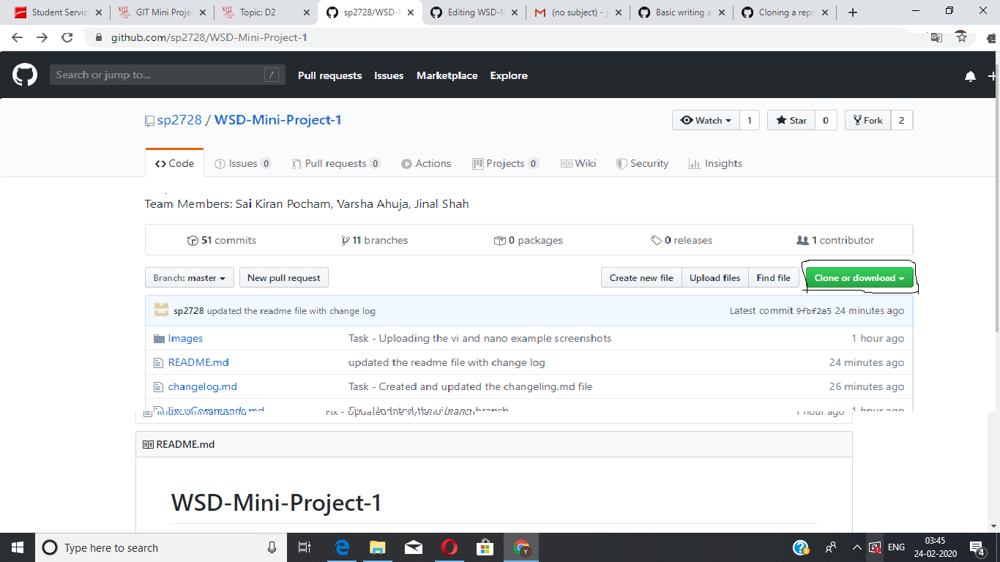

(ii) To clone the repository using HTTPS, under "Clone with HTTPS", click on that **Clone or download** and copy the link as shown below:

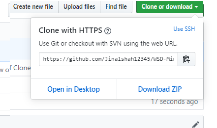

(iii) Open Git Bash

(iv) Change the current working directory to the location where you want the cloned directory to be made. Type git clone, and then paste the URL you copied in Step 2.

$ git clone https://github.com/YOUR-USERNAME/YOUR-REPOSITORY

(v) Press Enter. Your local clone will be created as shown in image screenshot below :

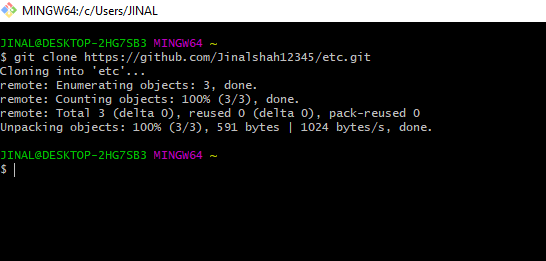

## 3. Fork
A fork is a copy of a repository that allows you to freely experiment with changes without affecting the original project. 

Forking a project is as easy as clicking the Fork button in the header of a repository. Once the process is complete, you'll be taken right to your the forked copy of the project so you can start collaborating!

If you want to fork someone's repository, then we just have to go to that repository and click on the **Fork** button as shown in image below:

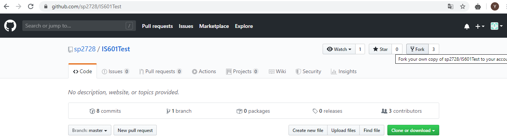

Forking a repository will copy the main data such as files and code. Issues, branches, pull requests and other features, however, will not copy over to your fork.

## 4. Branch

Git Branches plays crucial role in your daily development process. 

In GitHub, they are basically pointers which reflect snapshots of your changes. Whenever you add a new feature, you can just create new branch to enclose your changes. 

This prevents your code to get merged with main code base. 
Master is default branch in github.

The git branch command lets you create, list, rename, and delete branches.

Branches help you organize the workflow of organization more efficiently and rather effortlessly.

You can create new branch in github by using following command : git branch <branch_name>

Below is Image Screenshot which describes the creation of branch workflow :

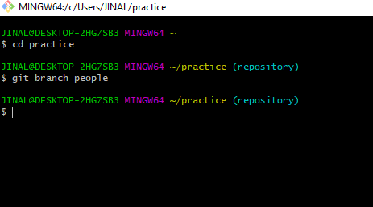

You can even switch to another branch by using following command : git checkout <branch_name>

Below is Image Screenshot which describes the Switching of branch workflow :

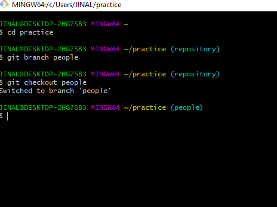

You can delete your branch by using following command : git branch -d <branch_name>

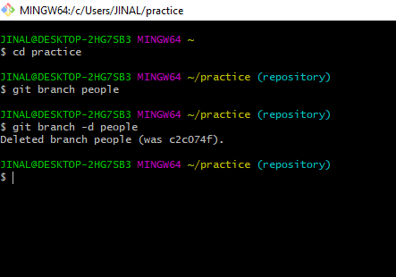
 
## 5. Commit

A Commit is an individual change to a file. It's like when you save a file, except with Git, every time you save it creates a unique ID that allows you to keep record of what changes were made when and by who. 

Commits usually contain a commit message which is a brief description of what changes were made.

Below Image Screenshot describes the process of Commit Workflow, in the image it states that one file was created, and to add that file to the branch, we need to first commit with a messsge using folllowing command : git commit -m 'xyz'. To summarize, if any changes are made, like if file is created or modified etc, we need to save those changes , hence we need to commit those changes.

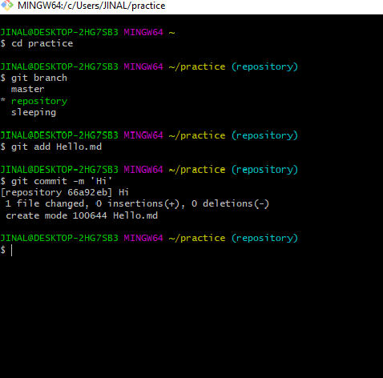

## 6. Merge

In GitHub, Merge Commit is used to combine two branches. Git merge will combine multiple sequences of commits into one unified history.
 
The git merge command lets you take the independent lines of development created by git branch and integrate them into a single branch.

You can merge two branches using following command : git merge <branch_name> 

Below Image Screenshot Shows the merging of two branches workflow :

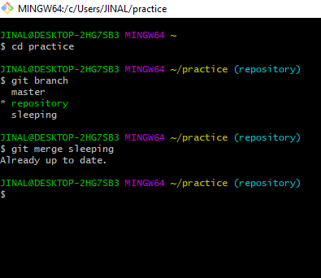

## 7. Checkout

The git checkout command lets you navigate between the branches created by git branch. 
In Git terms, a "checkout" is the act of switching between different versions of a target entity. 
The git checkout command operates upon three distinct entities: files, commits, and branches.

Below Image Screenshot explains the Checkout Workflow in which we are able to switch branches by using using following command : 
git checkout <branch_name>

## 8. Push

The git push command is used to upload local repository content to a remote repository. 
Pushing is how you transfer commits from your local repository to a remote repository.

Below Image Screenshot explain Git Push Workflow where changes made to the file are pushed from local repository to remote repository by using git push command :

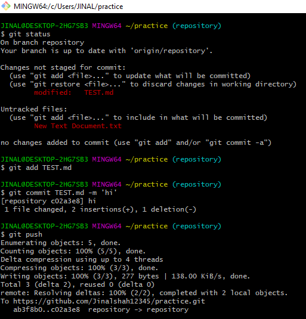

## 9. Pull

The git pull command is used to fetch and download content from a remote repository and immediately update the local repository to match that content.

Basically In Git, Pull command used to update the local version of a repository from a remote repository. 

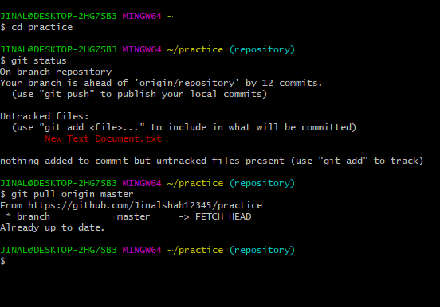

## 10. Remote Add / Remove / Show

### Remote Add
To add a new remote, use the git remote add command on the terminal, in the directory your repository is stored at.

Below Image Screenshot describes the Remote Add Workflow

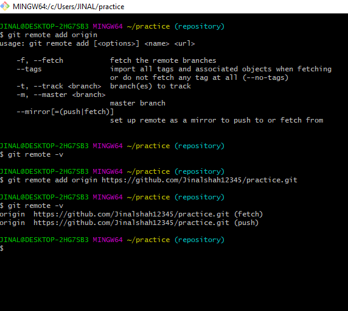

### Remote Remove
To remove a remote you can use the command git remote rm in the terminal, from the root folder of your repository.

Below Image Screenshot describes the Remote Remove Workflow

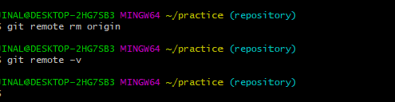

### Remote Show 
Remote Show command is used to display changes done i.e if we had performed commands like remote add or remote remove, then basically remote displays changes done or undone.

It uses Following command for remote show : git remote -v

