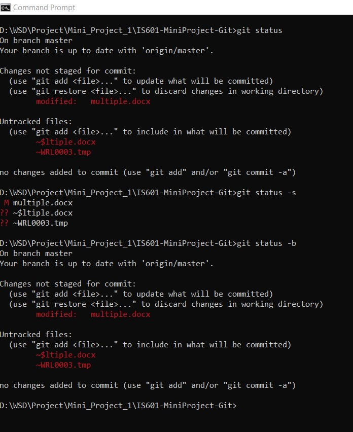

# &#x1F539; Git Commands &#x1F539;
## 1. Repository 
In GitHub, repository is a storage space where we can store our project. It can be local to a folder on your computer, or it can be a storage space on GitHub.

You can create a new repository on your personal account as shown in the image below:

In the upper-right corner of GitHub page, use the  drop-down menu, and select **New repository**.

In this way, you can create repositories on GitHub. 

## 2. Clone

When you create a repository on GitHub, it exists as a remote repository. 

Cloning a repsitory, basically means to create a local copy on your computer.

 You can simply do it with a command line: git clone 

For Example, git clone https://github.com/facebook/facebook-ios-sdk.git.

Following are steps for cloning a repository

(i) On GitHub, navigate to the main page of the repository. Under the repository name, click **Clone or download** as shown in image below.

(ii) To clone the repository, click on that **Clone or download** and copy the link as shown below:

(iii) Open Git Bash

(iv) Change the current working directory to the location where you want the cloned directory to be made. Type git clone, and then paste the URL you copied in Step 2.

$ git clone https://github.com/YOUR-USERNAME/YOUR-REPOSITORY

(v) Press Enter. Your local clone will be created as shown in image screenshot below :

## 3. Fork
A fork allows you to freely experiment with changes without affecting the original project by making a copy of a repository.

Forking a project is as easy as clicking the Fork button in the header of a repository. Once the process is complete, you'll be taken right to your the forked copy of the project so you can start collaborating!

If you want to fork someone's repository, then we just have to go to that repository and click on the **Fork** button as shown in image below:

Forking a repository will copy the main data such as files and code. Issues, branches, pull requests and other features, however, will not copy over to your fork.

## 4. Branch

Git Branches plays crucial role in your daily development process. 

In GitHub, they are basically pointers which depicts working of your changes. Whenever you add a new feature, you can just create new branch to enclose your changes. 

This prevents your code to get merged with main code base. 
Master is default branch in github.

The git branch command lets you create, list, rename, and delete branches.

You can create new branch in github by using following command : git branch <branch_name>

Below is Image Screenshot which describes the creation of branch workflow :

You can even switch to another branch by using following command : git checkout <branch_name>

Below is Image Screenshot which describes the Switching of branch workflow :

You can delete your branch by using following command : git branch -d <branch_name>

 
## 5. Commit

A Commit is an individual change to a file. It's like when you save a file, except with Git, every time you save it creates a unique ID that allows you to keep record of what changes were made when and by who. 

Commits usually contain a commit message which is a brief description of what changes were made.

Below Image Screenshot describes the process of Commit Workflow, in the image it states that one file was created, and to add that file to the branch, we need to first commit with a messsge using folllowing command : git commit -m 'xyz'. To summarize, if any changes are made, like if file is created or modified etc, we need to save those changes , hence we need to commit those changes.

## 6. Merge

In GitHub, Merge Commit is used to combine or merge two branches. 

Git merge will combine multiple sequences of commits into one unified history.

Using Git Merge command, we can merge multiple branches into single branch.
 
You can merge two branches using following command : git merge <branch_name> 

Below Image Screenshot Shows the merging of two branches workflow :

## 7. Checkout

The git checkout command lets you navigate between the branches created by git branch. 

The main use of git checkout command is you can switch from your current branch to another branch.

Below Image Screenshot explains the Checkout Workflow in which we are able to switch branches by using using following command : 
git checkout <branch_name>

## 8. Push

In GitHub, local repository content can be moved to a remote repository using Push Command.
Pushing is how you transfer commits from your local repository to a remote repository.

Below Image Screenshot explain Git Push Workflow where changes made to the file are pushed from local repository to remote repository by using git push command :

## 9. Pull

The git pull command is used to fetch and download content from a remote repository and immediately update the local repository to match that content.

Basically In Git, Pull command used to update the local version of a repository from a remote repository. 

## 10. Remote Add / Remove / Show

### Remote Add
To add a new remote, use the git remote add command on the terminal, in the directory your repository is stored at.

Below Image Screenshot describes the Remote Add Workflow

### Remote Remove
To remove a remote you can use the command git remote rm in the terminal, from the root folder of your repository.

Below Image Screenshot describes the Remote Remove Workflow

### Remote Show 
Remote Show command is used to display changes done i.e if we had performed commands like remote add or remote remove, then basically remote displays changes done or undone.

It uses Following command for remote show : git remote -v

## 11. Git Status
Git status command shows the differences in the index file and the current HEAD commit in any path, paths that have differences between the working tree and the index file, and paths in the working tree that are not tracked by Git. The first are what you would commit by running git commit; the second and third are what you could commit by running git add before running git commit.

OPTIONS
-s (--short)
Give the output in the short-format.

-b (--branch)
Show the branch and tracking info even in short-format.

Below is a screenshot of basic git status command which displays same result as that by git status -b

## 12. Master Branch
In Git, "master branch" is a default branch for a repository. After cloning a project from a remote directory, the resulting local repository has a single local branch: the so-called "master" branch. As you initially make commits, you’re given a master branch that points to the last commit you made. To avoid any kind of major errors in master branch, a develop branch should be created so that all the commits are peroformed to the code there and then final code is merged to the master branch. In short the master branch has the latest code.
