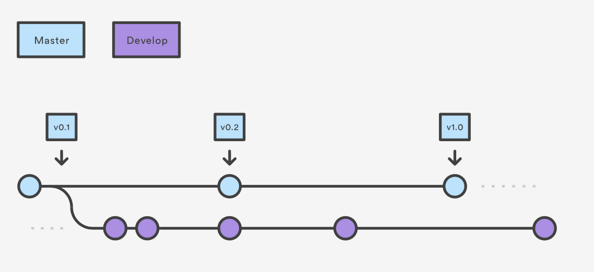

# Gitflow Workflow

Gitflow Workflow defines a strict branching model designed for managing the releases. This is the robust framework used for managing large projects.This is used for maintaining the sheduled releases. It assigns specific roles to different branches and defines how and when they should interact.In addition to feature branches, it uses individual branches for preparing, maintaining, and recording releases.

Gitflow is really an abstract class of Git Workflow. It help us to create organised branches and how they should merge with eachother. Gitflow can be implemented in many operating Systems.


## Installation

- On MacOS systems you can install the gitflow using the command.
  ```
  brew install gitflow
  ```
- On widows you will need to download and install the gitflow. Gitflow is already installed in most recent git versions.

## Workflow

Instead of single master branch, this workflow uses two branches to record the history of the project. The master branch stores the official release history and develop branch stores as an integration of the features.

When using the git-flow extension library, executing git flow init on an existing repo will create the develop branch.


Each new feature should have its own branch, which can be pushed to the central repository for backup/collaboration. But, instead of branching from teh master, feature branches use develop as their parent branch. When a feature is complete, it gets merged back into develop. Features should never interact directly with master.


We create a git feature branch using the following command
```
git flow feature start feature_branch
```


After finishing the feature branch, we have to merge it to the develop branch using the following command
```
git flow feature finish feature_branch
```

Once develop has aquired enough features for a release, you fork a release branch of develop. Creating this branch starts the next release cycle, so no new features can be added after this point—only bug fixes, documentation generation, and other release-oriented tasks should go in this branch. 

Once it's ready to ship, the release branch gets merged into master and tagged with a version number. In addition, it should be merged back into develop, which may have progressed since the release was initiated.

We can create a git release branch using the following command.
```
git flow release start 0.1.0
```


Once the release is ready to ship, it will get merged it into master and develop, then the release branch will be deleted. It’s important to merge back into develop because critical updates may have been added to the release branch and they need to be accessible to new features.
```
git flow release finish '0.1.0'
```

