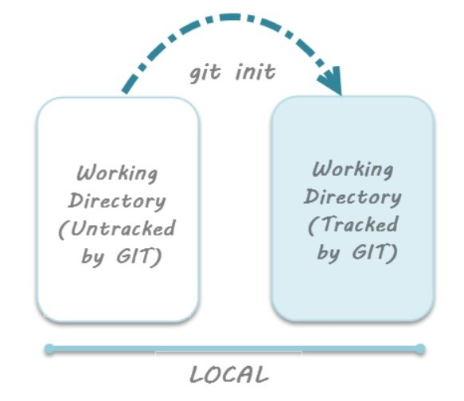
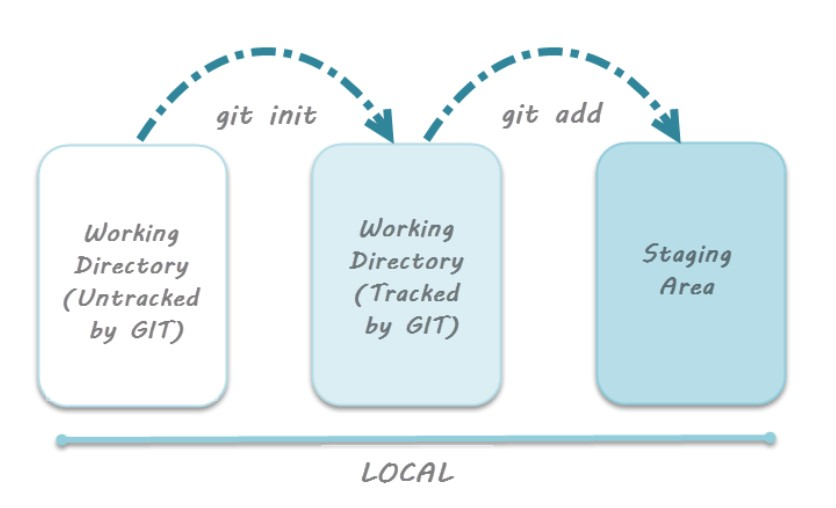
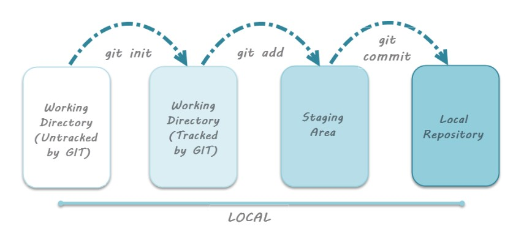
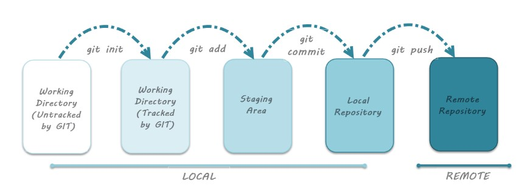

# &#x1F539; Git Lifecycle &#x1F539;

This tutorial will talk about the stages in Git lifecycle.

You can perform multiple actions in a Git project like creation, modification, deletion, refactoring, etc. Whether the project is a Git project or not these actions are always performed in a project. However in Git, the prjects are basically in one of the three stages (4th one being used when commiting changes to Remote directory):

1. [*Working Directory*](https://github.com/varshaahuja/WSD-Mini-Project-1/blob/master/gitLifecycle.md#-working-directory)
2. [*Staging Area*](https://github.com/varshaahuja/WSD-Mini-Project-1/blob/master/gitLifecycle.md#-staging-area)
3. [*Git Directory*](https://github.com/varshaahuja/WSD-Mini-Project-1/blob/master/gitLifecycle.md#-git-directory)
4. Additional [*Remote Directory*](https://github.com/varshaahuja/WSD-Mini-Project-1/blob/master/gitLifecycle.md#-remote-directory)

There is great flexibility in tracking the files due to these stages that files can reside in under Git. Let us look in brief about the three stages.

## &#x1F539; Working Directory:

When a project is on our local, it may or may not be tracked by Git, but still it is called our working directory. This contains a hidden .git folder in it when it is initialized to be tracked by Git. **git init** command is used to initialze the Git repository.

## &#x1F539; Staging Area:

Staging area is the place where you group, add and organize the files to be committed to Git for tracking their versions. We do not track all the files because as a part of any project multiple files are genearted dynamically like log file, class file, temporary data files, etc. Its not required to track the version of such files. Files containing business logic like the source code files, data files, configuration files and other project artifacts need to tracked version by version. Files are added to the staging area using Indexing process. **git add** is the command used to add files to staging area.

## &#x1F539; Git Directory:

Once the files are ready in staging area, we then perform commit using the **git commit -m "message"** command. This stage also records the author, commit message & time of commit. Also a snaphot of these set of files is takenby Git. All the information related to the commit is staored in Git and hence Git directory also acta as the database where the metadata about project files’ history are tracked.

## &#x1F539; Remote Directory:

As we work in teams, its important to understand this additional stage. After the code is commited to the local Git repository, it has to be pushed to remote repository where other collaborators can view the code. Here, Remote repository means replica or clone of the local Git repository in Github. And pushing means uploading the commits from local Git repository to remote repository hosted in Github. Thus, whatever changes you make in the local Git repository can be visible to other collaborators when you push your code to the remote repository. **git push** Command is used to push the code to remote repository in Github.

