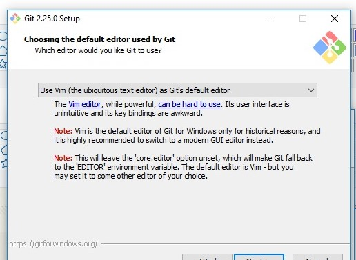

# 🔹 GIT 🔹

This document gives a basic understanding of Git and how to install Git.

## 🔹 Introduction:

Git is a *version control system* for tracking changes in computer files. It can be best used in teams working or developing same product but might or might not be working on the same module as it is distributed version-control system and tracks changes in source code during software development by maintaining change history. Although it is designed for coordinating work among programmers, it can be used to track changes in any set of files. The codes or files can be maintained either locally or remotely. The changes can be reverted anytime before moving the code to master repository.
The goal of GIT is to provide speed to a project, maintain data integrity, support distributed & non-linear workflows, increase efficiency.

## 🔹 Benefits to companies:

For an open-source project involving GIT, it makes it really easy for the developers to contribute to the project and get feedback about the project.GIT also being a repository, it provides access to your documents and code practically from any machine and anywhere. Most importantly, working in a team involves the collaboration of tasks and activities and GIT provides seamless collaboration. Changes can be tracked and one can have their version of code without having to worry about losing the previous version of code. 
With **Docker**, major benefits involve its portability on all major cloud platforms. with docker, it's easy to maintain your applications and code since they are well segmented, isolated and segregated. Each set of the application running in a docker container is well separated which provides increased security since the team can manager flow of traffic. Rapid deployment for any team using docker is a major advantage since it decreases time to market. The project team can benefit from the fact that it provides **continuous deployment and testing**. Since containers are configured to maintain application configuration internally, the team can use the same container from deploying to higher lanes from lower ones with no manual configuration changes. Any new changes can be made to the docker containers, have them tested and promoted to test and production environments and servers. Hence **continuous integration** is a key when it comes to using GIT and Docker as part of the development infrastructure for the project. This certainly increases productivity among the team members due to rapid development, testing, and deployment reduces cycle time and time to market.

## 🔹 Installing Git:

Below are the ways we can install Git on different operation systems:

   - Git can be installed in *Linux (Debian)* using $sudo apt-get install git
   - Git can be installed in *Linux (Fedora)* using $sudo yum install git
   - Git can be installed in *MAC* from [Git for MAC](https://git-scm.com/download/mac)
   - Git can be installed in *Windows* from [Git for Windows](https://git-scm.com/download/win)
   
Let us see the steps to install Git on Windows:

1. Go the URL https://git-scm.com/download/win and select 64 bit Git Windows setup for download.

2. On the Git Setup *Information* window hit *Next*.

3. On the Git Setup *Select Components* window select the below checkboxes and hit *Next*.

4. Choose a default editor on the next window. By default **Vim** editor is selected and hit *Next*.

5. Choose **Use the OpenSSL library** and hit *Next*.

6. Choose **Checkout Windows-style, commit Unix-style line endings** and hit *Next*.

7. Your Git will start installing, it may take a while to install.

8. After installation is complete, you will get screen like the below, you may select to both the checkboxes, or, just **Launch** Git to finsih.

9. If you get the below screen, you are ready to work with your Git.

10. Let’s just verify if the installation went well for Git. Go to *cmd* and type **git** and press enter. you should get the following output on the screen.

