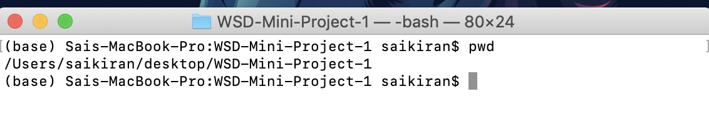
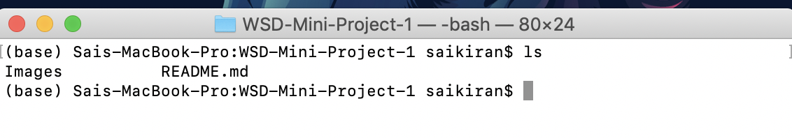

# Linux Commands

1. Cd command: cd command is used to change the current directory in Linux or other unix like operating system.

    Example: 
    ```
    cd desktop - This will make the current directory as Desktop.
    cd .. -  This will take you to the previous repository.
    ```     
    
2. Mkdir commad : mkdir command is used to create directories. It is also used to create multiple directories.

    Example: 
    ```
    mkdir hellos - This will make directory called 'hello' in the current directory.
    ```
3. Cp command: cp command is used to copy files or group files into the directory. It create an exact image of the file with a different name.

    Example:
    ```
    cp a.txt b.txt - This will copy the file a.txt into the directory with a name b.txt
    ```
 4. pwd command: pwd command is used to display the current working directory.
  
   Example: 
    
    
 5. ls command: ls command is used to list all the files in current directory.
 
   Example:
   
   
