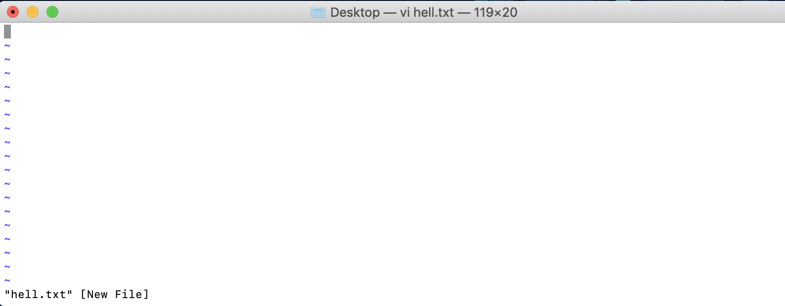

# Linux Text Editing

 When working with text editors, you pretty much choose between Vi or Nano.
 
1. Working in 'vi' editor:
   - Vi will automatically open in Command mode. On the bottom you will see some info such as the name of the document & info on whether it is a new file or an existing one. Let's look at an existing file. 
   - There are three modes to Vi: Command mode, Text mode & Ex Mode. 
   - Command Mode: If you tried to start typing in command mode you wouldn't be able to. 
     
   - Text/ Insert Mode: You need to hit the “I” in order to get into text mode.
     
   - Ex mode: You can then get back to command mode by the ESC key. Typng “:” will put you into Ex mode.
   - In order to quit Vi, you have to hit the Esc key and then enter in “:” along with “q” for quit.
     

2. Working with 'nano' editor: Nano has a pseudo-graphical layout that makes it a little easier to jump right into. 
   - There will be list of commands to perform which are displayed at the bottom of the nano editor.
     

# Linux Commands

1. Cd command: cd command is used to change the current directory in Linux or other unix like operating system.

   Example: 
    ```
    cd desktop - This will make the current directory as Desktop.
    cd .. -  This will take you to the previous repository.
    ```     
    
2. Mkdir commad : mkdir command is used to create directories. It is also used to create multiple directories.

   Example: 
    ```
    mkdir hellos - This will make directory called 'hello' in the current directory.
    ```
3. Cp command: cp command is used to copy files or group files into the directory. It create an exact image of the file with a different name.

   Example:
    ```
    cp a.txt b.txt - This will copy the file a.txt into the directory with a name b.txt
    ```
4. pwd command: pwd command is used to display the current working directory.
  
   Example: 
    
    
5. ls command: ls command is used to list all the files in current directory.
 
   Example:
   
   
 
6. mv command: mv command is used to move the files from one place to another place. It is also used to move multiple files.
    
   Example:
   ```
   mv hello.txt red.txt - This will make the file hello.txt to rename to red.txt and move the content into this.
   ```  
7. rm command: rm command is used to remove the files from the current directory. We can remove multiple files from the directory.

   Example: 
   ```
   rm a.txt - This will delete the file 'a.txt' from the current directory
   ```
8. History command: This command will show the history of the most recent commands you have performed on your computer.

   Example:
   
   
9. Home Directory or ~ command: This command is used to move the current directory to the home directory.

   Example:
   

10. File Paths in Linux: File paths is human readable representation of the file/folder location in computer.The forward slashes indicate that one item is stored inside of the item preceding it.
```
etc/library/hello.txt - This means hello.txt is stored in 'library' folder. And Library folder is stored in 'etc' folder.
```
