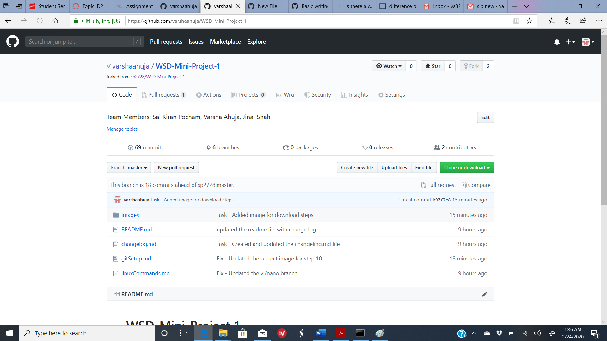
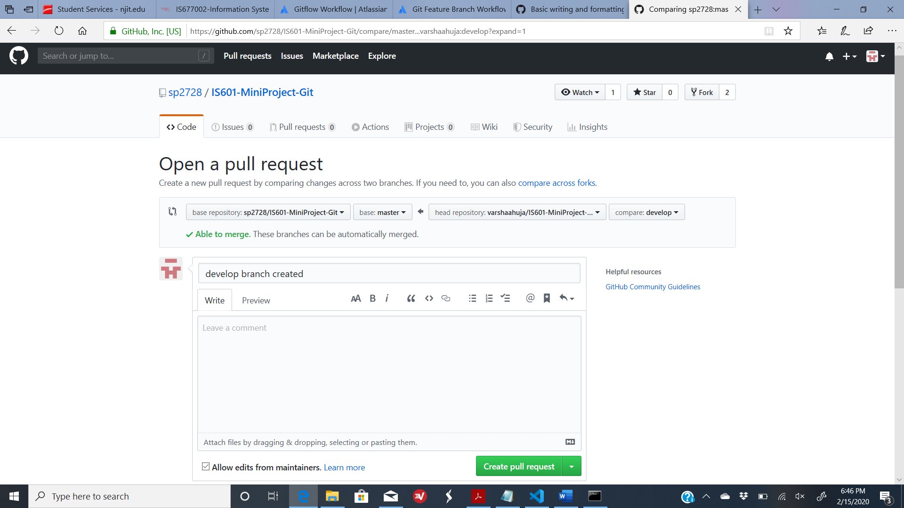
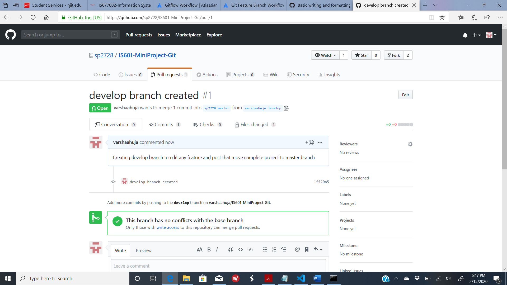

# &#x1F539; Pull Request &#x1F539;

In this section we will discuss the need & way to create a pull request.

When you clone or fork a repository and make some changes in your cloned/forked repository, you need to create a pull request in order for the changes to be merged to the master repository.
A pull request can be created directly if you have forked a repository. But if you have cloned a repository and are not working as a collaborator then you need to create the pull request by forking the repository.

Below are simple steps that show how to create pull request:

1. Navigate to your Github account & navigate to the forked repository where you want to create the request.

2. When you click on *New Pull Request* button as shown inabove image, below screen would open.

3. Select the master repository where you want to update the changes to and from which branch you want to perform the action from your forked repository.

4. Provide proper comments so that the owner of original repository can understand the changes you want to merge.

5. Click on *Create Pull Request* button to complete the request.

6. The pull request is received by the owner of master repository (of the cloned repository) under the pull requests tabs.

7. The owner can then decide if to merge the changes or not. Below is the screenshot of the screen.

